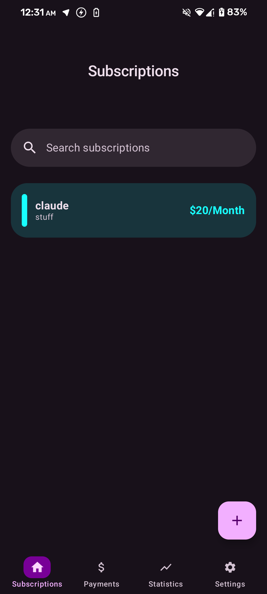
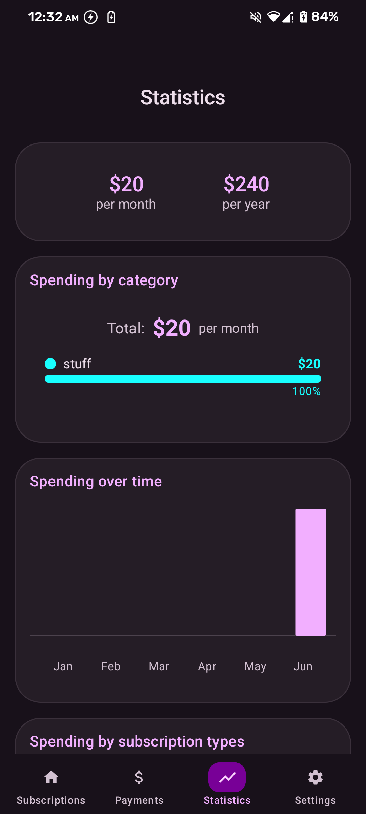
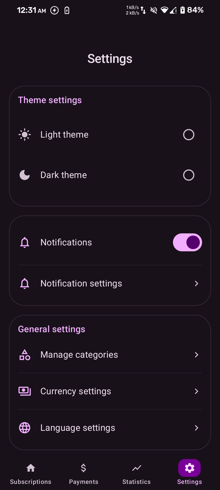
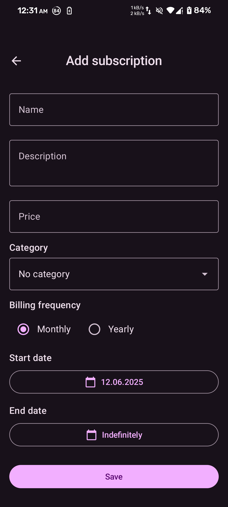

# Trackify 📱

**Modern subscription management app for Android**

*Never miss a subscription payment again*

## 📱 Описание

Trackify — современное Android‑приложение для управления подписками и регулярными платежами. Оно помогает отслеживать расходы, получать напоминания о предстоящих списаниях и держать финансы под контролем.

## ✨ Features

### 📊 Smart Tracking
- **Subscription Management** - Add, edit, and organize all your recurring payments
- **Payment History** - Complete transaction log with notes and dates
- **Smart Notifications** - Customizable reminders before payments are due
- **Multi-Currency Support** - Track subscriptions in USD, EUR, RUB, and more

### 📈 Analytics & Insights
- **Statistics Dashboard** - Visualize spending patterns with interactive charts
- **Category Organization** - Custom categories with color coding
- **Monthly/Yearly Overview** - Track spending trends over time
- **Expense Analysis** - Breakdown by subscription type and frequency

### 🎨 Modern Experience
- **Material 3 Design** - Beautiful, intuitive interface with dynamic colors
- **Dark/Light Theme** - Automatic theme switching based on system preferences
- **Multi-language Support** - Available in English and Russian
- **Responsive UI** - Optimized for all screen sizes

### 🔒 Privacy & Data
- **Local Storage** - All data stays on your device
- **Data Export/Import** - Backup and restore via JSON files
- **No Telemetry** - Zero data collection or tracking
- **Open Source** - Transparent and community-driven

## 📱 Screenshots

| Home Screen                        | Statistics                           | Settings                                   | Add Subscription                 |
|------------------------------------|--------------------------------------|--------------------------------------------|----------------------------------|
|  |  |  |  |
